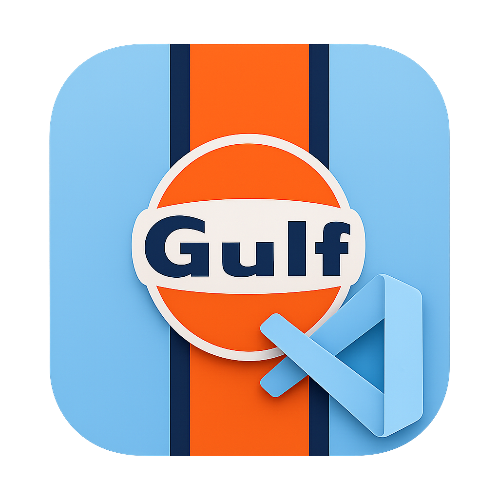

# Gulf Theme

<p align="center">
  
</p>

<p align="center">
  
  
  
</p>

A bold dark theme for Visual Studio Code inspired by the classic Gulf racing palette: cool blue surfaces, vivid orange highlights, and a focused high-contrast editor.

Gulf Theme is built for developers who want a dark workspace with personality while keeping code readable for long sessions.

## Theme

| Theme | Type | Description |
| --- | --- | --- |
| Gulf Dark | Dark | A racing-inspired dark theme with Gulf blue UI accents and bright orange focus states. |

## Palette

| Color | Hex | Usage |
| --- | --- | --- |
| Gulf Blue | `#afd4e8` | Activity bar, sidebar text, selections, highlights |
| Racing Orange | `#ff5717` | Cursor, focus borders, active tabs, primary actions |
| Midnight | `#121314` | Editor background |
| Pit Wall | `#191A1B` | Sidebar, title bar, panels |
| Deep Navy | `#00246b` | Badges and strong contrast accents |
| Steel Text | `#BBBEBF` | Editor foreground |

## Highlights

- Polished VS Code workbench colors for a consistent dark interface.
- Bright orange interaction states for quick visual orientation.
- Soft Gulf blue selection and highlight colors that stand out without overpowering code.
- High-contrast editor background and foreground for comfortable daily use.
- Packaged as a standard VS Code color theme contribution.

## Installation

### From Source

1. Download or clone this repository.
2. Place the project folder in your VS Code extensions directory:

   - macOS and Linux: `~/.vscode/extensions/gulf-theme`
   - Windows: `%USERPROFILE%\.vscode\extensions\gulf-theme`

3. Reload VS Code.
4. Open `Preferences: Color Theme`.
5. Select `Gulf Dark`.

### Development Mode

1. Open this repository in VS Code.
2. Press `F5` to launch an Extension Development Host.
3. In the new VS Code window, open `Preferences: Color Theme`.
4. Select `Gulf Dark`.

## Project Structure

```text
.
|-- package.json
|-- README.md
|-- CHANGELOG.md
`-- themes
    `-- gulf-dark-color-theme.json
```

## Release Notes

See [CHANGELOG.md](CHANGELOG.md) for release history.

## Disclaimer

This is an unofficial theme inspired by classic Gulf racing colors. It is not affiliated with or endorsed by Porsche, Gulf, Microsoft, or Visual Studio Code.
